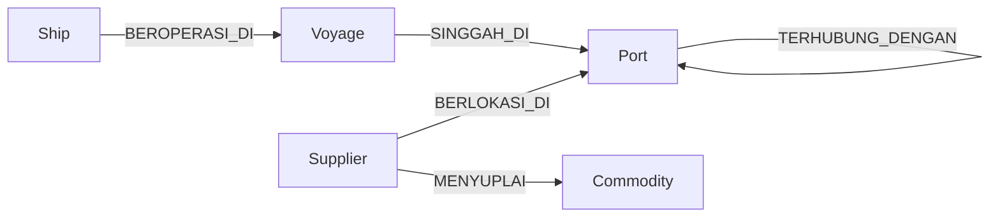

# OptiCargo Knowledge Graph

`opticargo-knowledge-graph` menyediakan projection graph read model pada Neo4j untuk konteks kapal, voyage, pelabuhan, rute, supplier, dan komoditas. PostgreSQL dan data seed tetap menjadi source of truth; graph dapat dibangun ulang dari projection tersebut.

## Kemampuan

- Query `GraphContext` bertipe untuk voyage, kapasitas kapal, rute aktif, dan kandidat backhaul.
- Query read-only untuk backhaul discovery, cargo matching, pathfinding, dan spatial lookup.
- Client Neo4j bersama untuk `opticargo-agents` dan `opticargo-rag-pipeline`.
- Schema constraint/index Cypher, lifecycle worker, dan reconciliation helper.

## Model graph



Untuk sebuah voyage, `find_backhaul_graph_context` memprioritaskan supplier pada pelabuhan tujuan sebagai kandidat muatan balik. Semua query aplikasi harus parameterized dan read-only.

## Integrasi

| Repository | Peran |
|---|---|
| `opticargo-data` | Data seed pelabuhan, kapal, rute, voyage, supplier, dan komoditas. |
| `opticargo-shared` | Kontrak `GraphContext` dan model lintas layanan. |
| `opticargo-agents` | Analisis rute dan kandidat backhaul. |
| `opticargo-rag-pipeline` | Enrichment graph untuk retrieval regulasi. |
| `opticargo-infra` | Runtime Neo4j dan graph worker. |

## Menjalankan lokal

```powershell
cd "D:\PROYEK ML DAN AI\OptiCargo\opticargo-infra"
docker compose -f docker-compose.yml -f compose/overrides/local-build.yml --profile core --profile ai up -d neo4j graph-worker
docker compose -f docker-compose.yml -f compose/overrides/local-build.yml --profile core --profile ai ps neo4j graph-worker
```

Konfigurasi menggunakan `NEO4J_URI`, `NEO4J_USER`, `NEO4J_PASSWORD`, dan `WORKER_HEARTBEAT_SECONDS`. Nilai credential dikelola melalui environment infra, bukan source.

## Operasi aman

- Gunakan `graph_context.py` untuk integrasi agents/RAG karena menghasilkan model typed dari `opticargo-shared`.
- Seeding dan mutasi projection dilakukan melalui workflow data yang disetujui; jangan menjalankan mutasi Cypher langsung di environment bersama.
- Graph worker saat ini menangani lifecycle/heartbeat runtime. Proyeksi domain dan reconciliation harus tetap idempotent.

## Dokumentasi

- [Mulai dari sini](docs/00_START_HERE.md)
- [Spesifikasi graph](docs/GRAPH_SCHEMA_SPECIFICATION.md)
- [Model projection](docs/PROJECTION_MODEL.md)
- [Library query](docs/QUERY_LIBRARY.md)
- [Kontrak interface](docs/INTERFACE_CONTRACTS.md)
